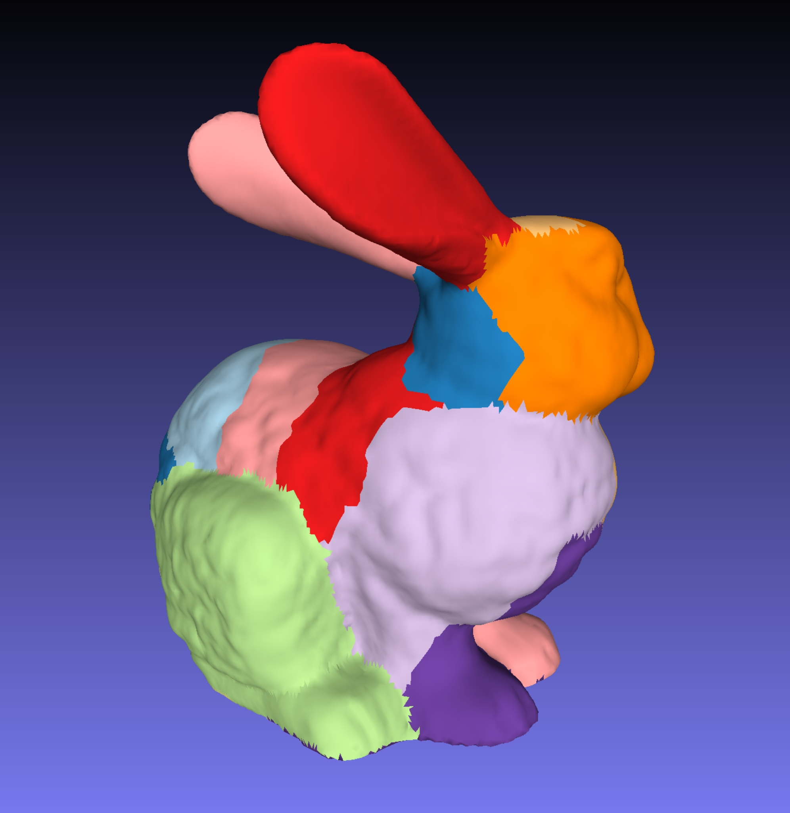
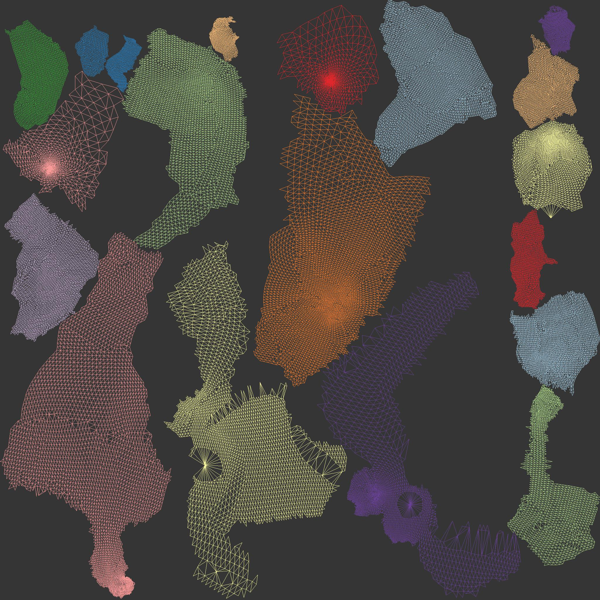

# Implementation of [Least Squares Conformal Maps for Automatic Texture Atlas Generation](https://members.loria.fr/Bruno.Levy/papers/LSCM_SIGGRAPH_2002.pdf)

Implemented in C++ using Eigen.

Mesh with Charts | UV Map
---------------------------------------|----------------------------------
 | 

## Project Organization
The project consists of:

##### LSCM
A tool for generating a uv parameterization for the specified mesh.

## Usage
##### LSCM
````
./lscm -i [input_mesh] -o [ouput_path] (-v [viz_path]) (-r [resolution]) (-p [padding])
````
- input_mesh - Path to the input mesh
- ouput_path - Path to the output file
- viz_path - Optional path to directory for visualizations
- resolution - Optional resolution used for packing
- padding - Optional distance, in pixels, between each packed chart
